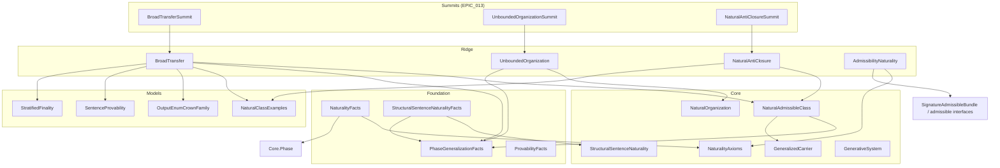

# Strengthened dependency map (`EPIC_013`)

**Purpose:** Import-oriented spine for **`SPEC_054_NS1`–`SPEC_058_NS5`** modules and summits. Base crown (`EPIC_012`, `GeneralizedFinalCrownPackage`) is **presupposed**, not replaced.

**Orchestration:** [`../specs/INCOMPLETE/IN-PROCESS/EPIC_013_NATURALITY_AND_INEVITABILITY_STRENGTHENING/EPIC_013_MASTER_ORCHESTRATION.md`](../specs/INCOMPLETE/IN-PROCESS/EPIC_013_NATURALITY_AND_INEVITABILITY_STRENGTHENING/EPIC_013_MASTER_ORCHESTRATION.md).

**Claim table:** [`STRENGTHENED_CLAIM_SURFACE.md`](STRENGTHENED_CLAIM_SURFACE.md).

---

## Layered imports (summit → ridge → foundation/core)

_Nodes omit Mathlib transitives._

---

## Direct `import` facts (verbatim)

| Module | Primary imports (high level) |
|--------|------------------------------|
| `Ridge.BroadTransfer` | `NaturalAdmissibleClass`, `GenerativeSystem`, `PhaseGeneralizationFacts`, `ProvabilityFacts`, `NaturalClassExamples`, `OutputEnumCrownFamily`, `SentenceProvability`, `StratifiedFinality` |
| `Ridge.AdmissibilityNaturality` | Core naturality + admissible-bundle ridge |
| `Ridge.UnboundedOrganization` | `NaturalOrganization`, `PhaseGeneralizationFacts`, organization ridge |
| `Ridge.NaturalAntiClosure` | `NaturalAdmissibleClass`, models + foundation facts per file |
| `Summits.BroadTransferSummit` | `Ridge.BroadTransfer` |
| `Summits.UnboundedOrganizationSummit` | `Ridge.UnboundedOrganization` |
| `Summits.NaturalAntiClosureSummit` | `Ridge.NaturalAntiClosure` |

**Aggregate:** [`NoveltyTheory/All.lean`](../NoveltyTheory/All.lean) pulls summit modules when present in the library root imports.

---

_Last updated with [`THEOREM_INVENTORY.md`](THEOREM_INVENTORY.md) verification block (**2026-04-04**): `lake build` green; `Ridge.BroadTransfer` import row aligned with [`NoveltyTheory/Ridge/BroadTransfer.lean`](../NoveltyTheory/Ridge/BroadTransfer.lean)._
